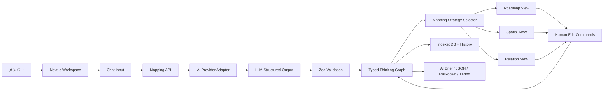

# アーキテクチャ設計書: Spatial Thinking Companion

## 1. 技術選定

### フロントエンド

- フレームワーク: Next.js App Router + React + TypeScript
  - Vercelへそのまま配置でき、画面とAI Route Handlerを単一リポジトリで管理できる
  - 思考データはClient Component側に保持し、秘密情報を必要とするAI処理だけサーバーへ分離する
- 構造グラフ描画: `@xyflow/react`（React Flow）
  - ノード・エッジが思考グラフと自然に対応し、直接編集、折り畳み、カスタムノード、差分更新を実装しやすい
  - 公式に大規模グラフ向けのmemoization、部分購読、折り畳みの指針がある
- 自由描画候補: `@excalidraw/excalidraw`をadapter境界の外側に保持
  - MVP中核には入れず、自由描画や`.excalidraw`出力が必要になった時だけ追加する
  - Excalidraw JSONを意味の正本にはしない
- 状態管理: Zustand + reducer型command history
  - 思考グラフ、UI選択状態、履歴を分離して部分購読する
  - AI更新と人間編集を同じcommandとして記録し、Undo/Redoする
- 検証: Zod
  - AI出力、JSON import、差分patchを同じschemaで検証する
- ローカル保存: IndexedDB（Dexie）
  - セッション、snapshot、historyをブラウザへ保存する
  - サーバーDBはMVPでは持たない
- レイアウト:
  - Roadmap: `d3-hierarchy`のtree layout
  - Relation: `@dagrejs/dagre`による有向グラフ配置
  - Spatial: 時間・抽象度・社会的範囲から決定的に座標変換

### バックエンド

- Next.js Route Handlers
  - `POST /api/map`: 初期思考グラフ生成
  - `POST /api/patch`: 現在枝に対する差分patch生成
  - `POST /api/unlock`: 共通アクセスコードを検証し、署名済みHttpOnly Cookieを発行
- AI abstraction: Vercel AI SDK
  - Zod schemaを使ったstructured outputを必須にする
  - provider adapterでOpenAI / Anthropicを交換可能にする
  - 初期既定は、低コストの構造化出力モデルを環境変数で指定する
- DB: なし
  - 思考データは端末ローカル
  - サーバーは入力をAI providerへ中継し、永続保存しない

### インフラ

- Hosting: Vercel Pro
  - Vercel Hobbyは非商用向けのため、sento.group社内利用はProを前提とする
- CI/CD: GitHub mainへのpushでPreview/Production build
- Security:
  - `SPATIAL_ACCESS_CODE`をサーバー環境変数へ保存
  - `SESSION_SECRET`で短期Cookieを署名
  - `/api/map`と`/api/patch`へVercel WAF rate limitを設定
  - AI provider keyはサーバー環境変数のみ
- Source: GitHub公開リポジトリ
  - アプリコードのみ公開し、API key・access code・利用データを含めない

## 2. アーキテクチャ図



## 3. 境界設計

```text
domain/       思考法の正本。UI・AI provider・描画ライブラリへ依存しない
mapping/      入力特性から手法を選び、各ビュー用projectionを作る
renderers/    React Flow等へprojectionを変換する
ai/           初期生成・差分patchのschema、prompt、provider adapter
storage/      IndexedDBへのsession/history保存
exports/      AI brief、JSON、Markdown、XMind
app/          Next.js画面とRoute Handlers
```

依存方向は常に外側から`domain`へ向ける。`domain`からReact Flow、Excalidraw、Next.js、特定AI modelを参照しない。

## 4. データモデル

### ThinkingSession

| Field | Type | Meaning |
|---|---|---|
| id | string | セッションID |
| title | string | 表示名 |
| graph | ThinkingGraph | 意味の正本 |
| activeBranchId | string? | 現在枝 |
| recommendedView | ViewKind | AI推奨ビュー |
| viewState | ViewState | 人間が調整した座標・折り畳み・ロック |
| history | GraphCommand[] | AI・人間編集の履歴 |
| createdAt | ISO datetime | 作成日時 |
| updatedAt | ISO datetime | 更新日時 |

### Node

| Field | Type |
|---|---|
| id | string |
| statement | string |
| type | fact / question / hypothesis / decision / action / risk |
| time | past / present / future / timeless |
| abstraction | concrete / structure / abstract |
| socialReach | self / close_group / organization / market / society / future_generations |
| certainty | 0..1 |
| status | active / resolved / parked |
| parentId | string? |
| facts | string[] |
| userLocked | boolean |

### Edge

| Field | Type |
|---|---|
| id | string |
| from | NodeId |
| to | NodeId |
| relation | causes / requires / means / supports / replaces / assumes / contradicts / includes / invalidates / affects / example_of |

### GraphCommand

```ts
type GraphCommand =
  | { type: 'node.add'; node: Node }
  | { type: 'node.update'; id: string; changes: Partial<Node> }
  | { type: 'node.remove'; id: string }
  | { type: 'node.move'; id: string; view: ViewKind; position: Position; lock?: boolean }
  | { type: 'node.merge'; sourceIds: string[]; target: Node }
  | { type: 'edge.add'; edge: Edge }
  | { type: 'edge.update'; id: string; changes: Partial<Edge> }
  | { type: 'edge.remove'; id: string }
  | { type: 'branch.activate'; id: string }
  | { type: 'graph.promote'; nodeId: string; reason: string };
```

AIの返却値も`GraphCommand[]`とし、直接stateを置換させない。

## 5. Mapping Strategy

```ts
interface MappingStrategy {
  kind: ViewKind;
  score(input: MappingSignals): number;
  explain(input: MappingSignals): string;
  project(graph: ThinkingGraph, viewState: ViewState): RenderProjection;
}
```

### 初期選択規則

- 手順、依存、目的から行動への連鎖が中心 → Roadmap
- 経緯・未来・抽象と具体の混線が中心 → Time × Abstraction
- 利害対象、短期最適、将来世代が中心 → Time × Social Reach
- 因果、前提、代替、矛盾、循環が中心 → Typed Relation

AIはsignalsと推奨理由を返すが、最終選択はユーザーが変更できる。すべてのビューは同じThinkingGraphから投影する。

## 6. API設計

### POST `/api/map`

Request:

```json
{ "input": "string", "locale": "ja" }
```

Response:

```json
{
  "reply": "string",
  "recommendedView": "roadmap",
  "recommendationReason": "string",
  "graph": {},
  "commands": []
}
```

### POST `/api/patch`

Requestは全文ではなく、north star、active branch subgraph、上位要約、unresolved、直近commandを送る。

Response:

```json
{
  "reply": "string",
  "commands": [],
  "requiresApproval": false,
  "restructureProposal": null
}
```

本筋変更、全体再構成、userLocked対象の変更が含まれる場合は`requiresApproval: true`とする。

### POST `/api/unlock`

- 共通コードをconstant-time比較する
- 成功時にHttpOnly / Secure / SameSite=Strict Cookieを発行する
- access codeそのものはCookieやlocalStorageへ保存しない

## 7. コスト見積もり

### 月額

- Vercel Pro: 20 USD/月から（20 USDの利用枠を含む。2026-07時点）
- AI API: 利用量課金。初期社内3〜10名・差分コンテキスト運用では月数USD〜数十USDを想定
- DB: 0 USD（MVPはローカル保存）
- Domain: 既存ドメインを使わなければ0 USD

### 初期構築

- 外部ライセンス費: 0 USD（主要候補はMIT）
- 開発工数: CodexによるMVP実装＋和島による実操作補正

## 8. リスクと代替案

| リスク | 影響 | 対策・代替案 |
|---|---|---|
| AIが大規模graphを壊す | 本筋・編集消失 | 全置換禁止、GraphCommand validation、userLocked、approval、Undo |
| 100ノードで描画が重い | 利用不能 | 部分購読、memo、折り畳み、簡素なedge、現在枝focus |
| React FlowがXMindほど自然でない | UX低下 | keyboard操作を独自実装。必要ならExcalidraw adapterを比較 |
| AI providerの構造化出力差 | 不整合 | Zod validation、retry、provider adapter、model比較 |
| local data消失 | 信頼低下 | IndexedDB snapshot、JSON export、crash recovery |
| 共通コード漏洩 | API費用流出 | code rotation、signed cookie、WAF rate limit、spend limit |
| 公開OSSの依存ライセンス | 顧客提供制約 | MIT優先、依存license audit、NOTICE管理 |

## 9. 採用根拠

- React Flowは保存・復元、custom nodes/edges、大規模graph向け最適化を公式に提供する
- Excalidrawは自由描画に優れるが、今回は型付き思考グラフの編集が中心である
- Vercel AI SDKのstructured outputによりprovider差をZod schemaで吸収できる
- Vercel WAFはAPI path単位のrate limitを提供する

## 10. 参照

- [Next.js App Router](https://nextjs.org/docs/app/getting-started)
- [React Flow performance](https://reactflow.dev/learn/advanced-use/performance)
- [React Flow save and restore](https://reactflow.dev/examples/interaction/save-and-restore)
- [AI SDK structured data](https://ai-sdk.dev/docs/ai-sdk-core/generating-structured-data)
- [Vercel rate limiting](https://vercel.com/kb/guide/add-rate-limiting-vercel)
- [Vercel pricing](https://vercel.com/pricing)
